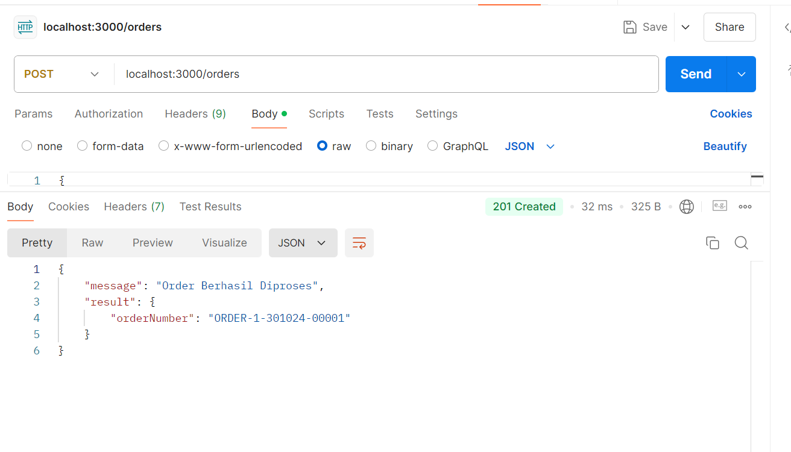
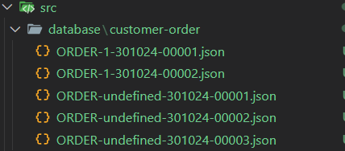

# Live test pt knitto

## Getting Started

1. Install dependencies using `npm install`.
2. Setup Redis in Local
3. Run the app using `npm run dev`.
4. hit endpoints localhost:3000/orders

result:

